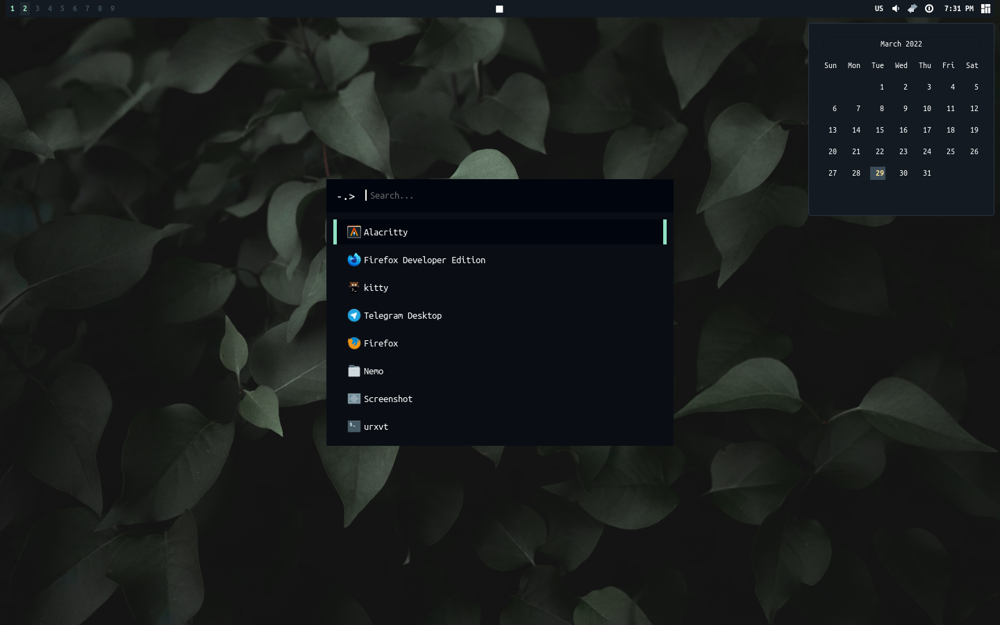
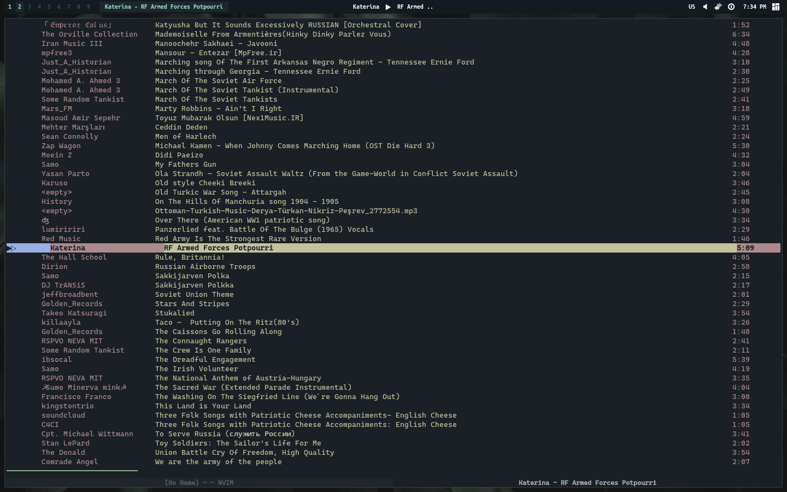

# my dotfiles

screenshot of desktop, rofi and calender.

screenshot of ncmpcpp

### tools i use
everyday editor > nvim \
browser > firefox \
wm > awesomewm \
terminal > alacritty \
developer tools > nvim, postman, beekeeper, alacritty \
other > mpd, ncmpcpp, zathura, ferdi, uget, zellij, soundcloud
